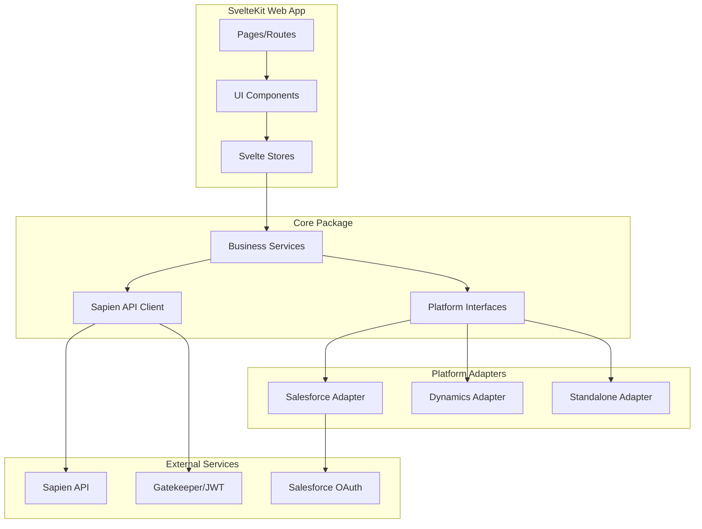
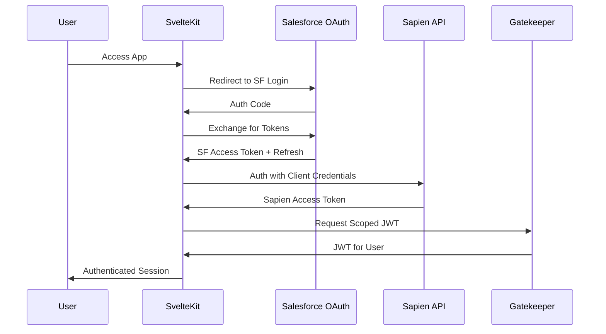

# Standalone AVS Platform Architecture

> Platform-agnostic version of the Natterbox AVS management application using SvelteKit/Node.js with Tailwind CSS, featuring a modern UI with Light/Dark/Salesforce theme support, comprehensive test coverage (95% target), and abstract interfaces enabling deployment on Salesforce, Microsoft Dynamics, or as a standalone app.

## Table of Contents

- [Best Practices & Standards](#best-practices--standards)
- [UI Design System](#ui-design-system)
- [Project Structure](#project-structure)
- [Architecture Layers](#architecture-layers)
- [Key Abstract Interfaces](#key-abstract-interfaces-packagescore)
- [Feature Modules](#feature-modules-to-port)
- [Authentication Flow](#authentication-flow)
- [Implementation Phases](#implementation-phases)
- [Theme Implementation](#theme-implementation)
- [Testing Configuration](#testing-configuration)

---

## Best Practices & Standards

### Code Quality

- **TypeScript Strict Mode**: Enable all strict compiler options
- **ESLint + Prettier**: Consistent code style with auto-formatting
- **Husky + lint-staged**: Pre-commit hooks for quality gates
- **Conventional Commits**: Semantic versioning and changelog generation
- **Dependency Injection**: Use interfaces for testability and loose coupling
- **SOLID Principles**: Single responsibility, open/closed, etc.
- **Error Handling**: Custom error classes, proper error boundaries in UI

### Testing Strategy (95% Coverage Target)

```
┌─────────────────────────────────────────────────────────────┐
│                    Testing Pyramid                          │
├─────────────────────────────────────────────────────────────┤
│                      E2E Tests                              │
│                    (Playwright)                             │
│                   Critical Flows                            │
├─────────────────────────────────────────────────────────────┤
│              Integration Tests (Vitest)                     │
│         API Routes, Store Logic, Service Layer              │
├─────────────────────────────────────────────────────────────┤
│                 Unit Tests (Vitest)                         │
│     Components, Utils, Pure Functions, Models               │
└─────────────────────────────────────────────────────────────┘
```

| Test Type | Tool | Coverage Target | Focus |
|-----------|------|-----------------|-------|
| Unit | Vitest + Testing Library | 95% | Components, utils, services |
| Integration | Vitest + MSW | 90% | API routes, stores, adapters |
| E2E | Playwright | Critical paths | Auth flow, CRUD operations |
| Component | Storybook + Chromatic | Visual | UI components in isolation |

### Test File Structure

```
packages/
├── core/
│   └── src/
│       ├── services/
│       │   ├── sapien-client.ts
│       │   └── __tests__/
│       │       ├── sapien-client.test.ts
│       │       └── sapien-client.integration.test.ts
├── web/
│   └── src/
│       ├── lib/components/
│       │   ├── Button.svelte
│       │   └── Button.test.ts
│       └── routes/
│           └── users/
│               ├── +page.svelte
│               └── +page.server.test.ts
└── e2e/
    └── tests/
        ├── auth.spec.ts
        └── users.spec.ts
```

---

## UI Design System

### Theme Architecture

- **Tailwind CSS** with custom configuration
- **CSS Custom Properties** for dynamic theming
- **Three theme options**: Light, Dark, and Salesforce Lightning
- **System preference detection** via `prefers-color-scheme` (for light/dark)
- **Manual toggle** with persistent preference in localStorage
- **Smooth transitions** between themes

### Color Palette

```css
/* Light Theme - Modern & Clean */
--color-bg-primary: #ffffff;
--color-bg-secondary: #f8fafc;
--color-bg-tertiary: #f1f5f9;
--color-text-primary: #0f172a;
--color-text-secondary: #475569;
--color-accent: #3b82f6;
--color-accent-hover: #2563eb;
--color-border: #e2e8f0;
--color-success: #22c55e;
--color-warning: #f59e0b;
--color-error: #ef4444;

/* Dark Theme - Sleek & Modern */
--color-bg-primary: #0f172a;
--color-bg-secondary: #1e293b;
--color-bg-tertiary: #334155;
--color-text-primary: #f1f5f9;
--color-text-secondary: #94a3b8;
--color-accent: #60a5fa;
--color-accent-hover: #93c5fd;
--color-border: #334155;
--color-success: #4ade80;
--color-warning: #fbbf24;
--color-error: #f87171;

/* Salesforce Lightning Theme - SLDS Inspired */
--color-bg-primary: #ffffff;
--color-bg-secondary: #f3f3f3;
--color-bg-tertiary: #fafaf9;
--color-text-primary: #181818;
--color-text-secondary: #444444;
--color-accent: #0176d3;           /* SF Brand Blue */
--color-accent-hover: #014486;
--color-border: #c9c9c9;
--color-success: #2e844a;          /* SF Success Green */
--color-warning: #fe9339;          /* SF Warning Orange */
--color-error: #ea001e;            /* SF Error Red */
--color-header-bg: #0176d3;        /* SF Blue header */
--color-header-text: #ffffff;
--shadow-card: 0 2px 2px 0 rgba(0,0,0,0.1);
--border-radius: 0.25rem;          /* SF uses subtle rounding */
```

### Typography

- **Font**: Inter (headings), JetBrains Mono (code/data)
- **Scale**: Tailwind default with custom additions
- **Responsive**: Fluid typography for all screen sizes

### Component Library

| Component | Description |
|-----------|-------------|
| `Button` | Primary, secondary, ghost, danger variants |
| `DataTable` | Sortable, filterable, paginated tables |
| `Modal` | Accessible dialog with focus trap |
| `Form` | Form controls with validation |
| `Toast` | Notification system |
| `Sidebar` | Collapsible navigation |
| `ThemeToggle` | Light/Dark/Salesforce/System theme selector dropdown |
| `Card` | Content containers |
| `Badge` | Status indicators |
| `Avatar` | User avatars with fallback |

### Layout Structure

```svelte
<!-- +layout.svelte -->
<div class="min-h-screen bg-bg-primary text-text-primary transition-colors">
  <Header>
    <Logo />
    <Navigation />
    <div class="flex items-center gap-4">
      <ThemeToggle />
      <UserMenu />
    </div>
  </Header>
  <div class="flex">
    <Sidebar />
    <main class="flex-1 p-6">
      <slot />
    </main>
  </div>
</div>
```

---

## Project Structure

```
standalone-avs/
├── packages/
│   ├── core/                       # Platform-agnostic business logic
│   │   ├── src/
│   │   │   ├── interfaces/         # Abstract platform interfaces
│   │   │   ├── services/           # Sapien API client
│   │   │   │   ├── __tests__/      # Service unit tests
│   │   │   │   └── __mocks__/      # MSW handlers
│   │   │   ├── models/             # Domain models & Zod schemas
│   │   │   └── utils/
│   │   ├── vitest.config.ts
│   │   └── package.json
│   │
│   ├── platform-salesforce/        # Salesforce adapter implementation
│   │   ├── src/
│   │   │   ├── auth/               # SF OAuth implementation
│   │   │   ├── data-store/         # SF data operations
│   │   │   └── __tests__/
│   │   └── package.json
│   │
│   ├── platform-dynamics/          # Future: Dynamics adapter
│   │
│   └── web/                        # SvelteKit application
│       ├── src/
│       │   ├── lib/
│       │   │   ├── components/     # Reusable UI components
│       │   │   │   ├── ui/         # Base components (Button, Modal, etc.)
│       │   │   │   └── domain/     # Business components (UserCard, etc.)
│       │   │   ├── stores/         # Svelte stores
│       │   │   ├── actions/        # Svelte actions
│       │   │   └── utils/
│       │   ├── routes/
│       │   │   ├── +layout.svelte  # Root layout with theme
│       │   │   ├── +layout.server.ts
│       │   │   ├── (auth)/         # Auth route group
│       │   │   ├── (app)/          # Protected app routes
│       │   │   │   ├── users/
│       │   │   │   ├── groups/
│       │   │   │   ├── devices/
│       │   │   │   ├── call-flows/
│       │   │   │   └── settings/
│       │   │   └── api/            # API routes
│       │   ├── hooks.server.ts     # Auth middleware
│       │   └── app.css             # Tailwind + theme CSS
│       ├── static/
│       │   └── fonts/
│       ├── tailwind.config.ts
│       ├── vitest.config.ts
│       └── package.json
│
├── e2e/                            # End-to-end tests
│   ├── tests/
│   │   ├── auth.spec.ts
│   │   ├── users.spec.ts
│   │   └── fixtures/
│   └── playwright.config.ts
│
├── docs/                           # Documentation
│   └── ARCHITECTURE.md
│
├── .storybook/                     # Storybook configuration
├── .husky/                         # Git hooks
├── pnpm-workspace.yaml
├── vitest.workspace.ts             # Workspace test config
├── tsconfig.json
├── .prettierrc
├── .eslintrc.cjs
└── package.json
```

## Architecture Layers



## Key Abstract Interfaces (packages/core)

```typescript
// IPlatformAdapter - Main abstraction for CRM platforms
interface IPlatformAdapter {
  auth: IAuthProvider;
  dataStore: IDataStore;
  events: IEventBus;
  identity: IIdentityProvider;
}

// IAuthProvider - Authentication abstraction
interface IAuthProvider {
  login(): Promise<AuthResult>;
  logout(): Promise<void>;
  refreshToken(): Promise<TokenSet>;
  getCurrentUser(): Promise<PlatformUser>;
}

// IDataStore - Data persistence abstraction  
interface IDataStore {
  query<T>(entity: string, filters: QueryFilter[]): Promise<T[]>;
  get<T>(entity: string, id: string): Promise<T>;
  create<T>(entity: string, data: Partial<T>): Promise<T>;
  update<T>(entity: string, id: string, data: Partial<T>): Promise<T>;
  delete(entity: string, id: string): Promise<void>;
}

// ISapienClient - Separated Sapien API concerns
interface ISapienClient {
  users: IUserService;
  groups: IGroupService;
  devices: IDeviceService;
  callFlows: ICallFlowService;
  insights: IInsightsService;
  // ... all Sapien domains
}
```

## Feature Modules to Port

Based on analysis of the Salesforce codebase (`avs-sfdx`):

| Module | Source Files | Priority |
|--------|-------------|----------|
| **Users** | `UserController.cls`, `UserListController.cls`, `users.page`, `useredit.page` | High |
| **Groups** | `GroupController.cls`, `GroupListController.cls` | High |
| **Devices** | `DeviceController.cls`, `DeviceMappingController.cls` | High |
| **Phone Numbers** | `PhoneNumberController.cls` | High |
| **Call Flows** | `CallFlowRemoting.cls`, `nbcf/` static resource | High |
| **Dial Lists** | `DialListController.cls`, `DialItemController.cls` | Medium |
| **Insights** | `InsightsConfigurationController.cls`, `InsightCategoryConfigController.cls` | Medium |
| **Availability Profiles** | `AvailabilityProfileController.cls` | Medium |
| **Recording Access** | `RecordingAccessController.cls` | Medium |
| **Settings** | `GeneralSettingsController.cls`, `APISettingsController.cls` | High |
| **Licensing** | `LicenseManager.cls` | High |
| **CTI Integration** | `NatterboxCTI` Aura component, `CTIRemoting.cls` | Medium |
| **Secure Pay/PCI** | `SecurePayController.cls` | Low |

## Authentication Flow



## Implementation Phases

### Phase 1: Foundation (Weeks 1-2)

- Monorepo setup with pnpm workspaces
- **Testing infrastructure**: Vitest, Playwright, coverage reporting
- **Tailwind + Theme system**: Light/Dark/Salesforce themes with system detection
- Core interfaces and type definitions
- Sapien API client (porting from `RestClient.cls` and `APIController.cls`)
- Salesforce OAuth adapter
- Basic SvelteKit app with auth flow and layout shell
- **Storybook** for component documentation

### Phase 2: Core Features (Weeks 3-6)

- **Component Library**: Build base UI components with tests
- User management (list, create, edit, deactivate)
- Group management
- Device management
- Phone number management
- Organization settings
- License management
- **E2E tests** for critical user journeys

### Phase 3: Advanced Features (Weeks 7-10)

- Call Flow Builder (rebuild in Svelte with drag-and-drop)
- Dial Lists management
- Availability Profiles
- Insights configuration
- Recording access controls
- **Visual regression tests** via Chromatic

### Phase 4: Integration Features (Weeks 11-12)

- CTI softphone integration
- Real-time call status (WebSocket/SSE)
- Platform event handling
- Wallboards
- **Performance testing** and optimization

---

## Theme Implementation

### ThemeToggle Component

```svelte
<!-- lib/components/ui/ThemeToggle.svelte -->
<script lang="ts">
  import { theme, setTheme, type Theme } from '$lib/stores/theme';
  import { Sun, Moon, Monitor, Cloud } from 'lucide-svelte';
  
  let isOpen = false;
  
  const themes: { value: Theme; label: string; icon: typeof Sun }[] = [
    { value: 'light', label: 'Light', icon: Sun },
    { value: 'dark', label: 'Dark', icon: Moon },
    { value: 'salesforce', label: 'Salesforce', icon: Cloud },
    { value: 'system', label: 'System', icon: Monitor },
  ];
  
  const currentIcon = $derived(
    themes.find(t => t.value === $theme)?.icon ?? Monitor
  );
</script>

<div class="relative">
  <button
    onclick={() => isOpen = !isOpen}
    class="p-2 rounded-lg hover:bg-bg-secondary transition-colors"
    aria-label="Change theme"
    aria-expanded={isOpen}
  >
    <svelte:component this={currentIcon} class="w-5 h-5" />
  </button>
  
  {#if isOpen}
    <div 
      class="absolute right-0 mt-2 w-40 bg-bg-primary border border-border 
             rounded-lg shadow-lg py-1 z-50"
    >
      {#each themes as { value, label, icon }}
        <button
          onclick={() => { setTheme(value); isOpen = false; }}
          class="w-full px-4 py-2 text-left flex items-center gap-3 
                 hover:bg-bg-secondary transition-colors
                 {$theme === value ? 'text-accent font-medium' : ''}"
        >
          <svelte:component this={icon} class="w-4 h-4" />
          {label}
        </button>
      {/each}
    </div>
  {/if}
</div>
```

### Theme Store

```typescript
// lib/stores/theme.ts
import { writable, derived } from 'svelte/store';
import { browser } from '$app/environment';

export type Theme = 'light' | 'dark' | 'salesforce' | 'system';

const THEME_CLASSES = {
  light: 'theme-light',
  dark: 'theme-dark',
  salesforce: 'theme-salesforce',
} as const;

function createThemeStore() {
  const stored = browser ? (localStorage.getItem('theme') as Theme) : 'system';
  const { subscribe, set } = writable<Theme>(stored || 'system');
  
  // Initialize theme on load
  if (browser) {
    applyTheme(stored || 'system');
    
    // Listen for system preference changes
    window.matchMedia('(prefers-color-scheme: dark)').addEventListener('change', (e) => {
      const current = localStorage.getItem('theme') as Theme;
      if (current === 'system') {
        applyTheme('system');
      }
    });
  }
  
  return {
    subscribe,
    set: (value: Theme) => {
      if (browser) localStorage.setItem('theme', value);
      set(value);
      applyTheme(value);
    },
  };
}

function applyTheme(theme: Theme) {
  if (!browser) return;
  
  const root = document.documentElement;
  
  // Remove all theme classes
  Object.values(THEME_CLASSES).forEach(cls => root.classList.remove(cls));
  root.classList.remove('dark');
  
  if (theme === 'system') {
    const prefersDark = window.matchMedia('(prefers-color-scheme: dark)').matches;
    root.classList.add(prefersDark ? 'theme-dark' : 'theme-light');
    root.classList.toggle('dark', prefersDark);
  } else if (theme === 'dark') {
    root.classList.add('theme-dark', 'dark');
  } else if (theme === 'salesforce') {
    root.classList.add('theme-salesforce');
    // Salesforce theme is light-based, no 'dark' class
  } else {
    root.classList.add('theme-light');
  }
}

export const theme = createThemeStore();
export const setTheme = theme.set;

// Derived store for checking if current theme is dark
export const isDark = derived(theme, ($theme) => {
  if (!browser) return false;
  if ($theme === 'dark') return true;
  if ($theme === 'system') {
    return window.matchMedia('(prefers-color-scheme: dark)').matches;
  }
  return false;
});
```

### Theme CSS Variables

```css
/* app.css - Theme definitions */
@tailwind base;
@tailwind components;
@tailwind utilities;

@layer base {
  /* Light Theme (default) */
  :root, .theme-light {
    --color-bg-primary: 255 255 255;
    --color-bg-secondary: 248 250 252;
    --color-bg-tertiary: 241 245 249;
    --color-text-primary: 15 23 42;
    --color-text-secondary: 71 85 105;
    --color-accent: 59 130 246;
    --color-accent-hover: 37 99 235;
    --color-border: 226 232 240;
    --color-success: 34 197 94;
    --color-warning: 245 158 11;
    --color-error: 239 68 68;
    --color-header-bg: 255 255 255;
    --color-header-text: 15 23 42;
  }
  
  /* Dark Theme */
  .theme-dark {
    --color-bg-primary: 15 23 42;
    --color-bg-secondary: 30 41 59;
    --color-bg-tertiary: 51 65 85;
    --color-text-primary: 241 245 249;
    --color-text-secondary: 148 163 184;
    --color-accent: 96 165 250;
    --color-accent-hover: 147 197 253;
    --color-border: 51 65 85;
    --color-success: 74 222 128;
    --color-warning: 251 191 36;
    --color-error: 248 113 113;
    --color-header-bg: 30 41 59;
    --color-header-text: 241 245 249;
  }
  
  /* Salesforce Lightning Theme */
  .theme-salesforce {
    --color-bg-primary: 255 255 255;
    --color-bg-secondary: 243 243 243;
    --color-bg-tertiary: 250 250 249;
    --color-text-primary: 24 24 24;
    --color-text-secondary: 68 68 68;
    --color-accent: 1 118 211;
    --color-accent-hover: 1 68 134;
    --color-border: 201 201 201;
    --color-success: 46 132 74;
    --color-warning: 254 147 57;
    --color-error: 234 0 30;
    --color-header-bg: 1 118 211;
    --color-header-text: 255 255 255;
    
    /* Salesforce-specific overrides */
    --shadow-card: 0 2px 2px 0 rgba(0, 0, 0, 0.1);
    --border-radius-base: 0.25rem;
    --font-family: 'Salesforce Sans', -apple-system, BlinkMacSystemFont, 'Segoe UI', sans-serif;
  }
}
```

### Tailwind Configuration

```typescript
// tailwind.config.ts
import type { Config } from 'tailwindcss';

export default {
  darkMode: 'class',
  content: ['./src/**/*.{html,js,svelte,ts}'],
  theme: {
    extend: {
      colors: {
        'bg-primary': 'rgb(var(--color-bg-primary) / <alpha-value>)',
        'bg-secondary': 'rgb(var(--color-bg-secondary) / <alpha-value>)',
        'bg-tertiary': 'rgb(var(--color-bg-tertiary) / <alpha-value>)',
        'text-primary': 'rgb(var(--color-text-primary) / <alpha-value>)',
        'text-secondary': 'rgb(var(--color-text-secondary) / <alpha-value>)',
        'accent': 'rgb(var(--color-accent) / <alpha-value>)',
        'accent-hover': 'rgb(var(--color-accent-hover) / <alpha-value>)',
        'border': 'rgb(var(--color-border) / <alpha-value>)',
        'success': 'rgb(var(--color-success) / <alpha-value>)',
        'warning': 'rgb(var(--color-warning) / <alpha-value>)',
        'error': 'rgb(var(--color-error) / <alpha-value>)',
      },
      fontFamily: {
        sans: ['Inter', 'system-ui', 'sans-serif'],
        mono: ['JetBrains Mono', 'monospace'],
      },
    },
  },
  plugins: [
    require('@tailwindcss/forms'),
    require('@tailwindcss/typography'),
  ],
} satisfies Config;
```

---

## Testing Configuration

### Vitest Workspace Config

```typescript
// vitest.workspace.ts
import { defineWorkspace } from 'vitest/config';

export default defineWorkspace([
  'packages/core/vitest.config.ts',
  'packages/platform-salesforce/vitest.config.ts',
  'packages/web/vitest.config.ts',
]);
```

### Package Vitest Config

```typescript
// packages/web/vitest.config.ts
import { defineConfig } from 'vitest/config';
import { sveltekit } from '@sveltejs/kit/vite';

export default defineConfig({
  plugins: [sveltekit()],
  test: {
    include: ['src/**/*.{test,spec}.{js,ts}'],
    environment: 'jsdom',
    coverage: {
      provider: 'v8',
      reporter: ['text', 'json', 'html'],
      threshold: {
        global: { branches: 95, functions: 95, lines: 95, statements: 95 }
      },
      exclude: ['**/*.stories.ts', '**/types/**', '**/__mocks__/**']
    },
    setupFiles: ['./src/test-setup.ts'],
  },
});
```

### Playwright E2E Config

```typescript
// e2e/playwright.config.ts
import { defineConfig, devices } from '@playwright/test';

export default defineConfig({
  testDir: './tests',
  fullyParallel: true,
  forbidOnly: !!process.env.CI,
  retries: process.env.CI ? 2 : 0,
  reporter: [['html'], ['json', { outputFile: 'results.json' }]],
  use: {
    baseURL: 'http://localhost:5173',
    trace: 'on-first-retry',
    screenshot: 'only-on-failure',
  },
  projects: [
    { name: 'chromium', use: { ...devices['Desktop Chrome'] } },
    { name: 'firefox', use: { ...devices['Desktop Firefox'] } },
    { name: 'webkit', use: { ...devices['Desktop Safari'] } },
    { name: 'mobile', use: { ...devices['iPhone 13'] } },
  ],
  webServer: {
    command: 'pnpm --filter web dev',
    url: 'http://localhost:5173',
    reuseExistingServer: !process.env.CI,
  },
});
```

---

---

## Salesforce External API Integration

### The Challenge

The existing AVS application runs natively on Salesforce and uses:
- **Apex classes** for server-side business logic
- **SOQL queries** for database operations
- **Internal Salesforce APIs** (DML, System methods, etc.)

The standalone application must replicate this functionality using **Salesforce's external REST APIs**.

### Available Salesforce REST APIs

| API | Endpoint Pattern | Use Case |
|-----|-----------------|----------|
| **REST API** | `/services/data/vXX.0/sobjects/{Object}` | CRUD operations on objects |
| **Query API** | `/services/data/vXX.0/query/?q={SOQL}` | Execute SOQL queries |
| **Apex REST** | `/services/apexrest/{endpoint}` | Call custom `@RestResource` endpoints |
| **Composite API** | `/services/data/vXX.0/composite` | Batch multiple operations |
| **Composite Graph** | `/services/data/vXX.0/composite/graph` | Complex dependent operations |
| **Bulk API 2.0** | `/services/data/vXX.0/jobs/ingest` | Large data operations |

### Existing Apex REST Endpoints (24 total)

These are **already externally accessible** via `/services/apexrest/`:

```typescript
// packages/core/src/services/salesforce/apex-rest-endpoints.ts
export const APEX_REST_ENDPOINTS = {
  // User Management
  userCreation: '/services/apexrest/usercreation',
  userDeletion: '/services/apexrest/userdeletion',
  
  // Dial Lists
  dialListLists: '/services/apexrest/DialList/lists',
  dialListSelect: '/services/apexrest/DialList/list/select',
  dialListItemActive: '/services/apexrest/DialList/item/active',
  dialListItemComplete: '/services/apexrest/DialList/item/complete',
  dialListItemPreview: '/services/apexrest/DialList/item/preview',
  dialListItemDiscardPreview: '/services/apexrest/DialList/item/discard-preview',
  dialListItemSelect: '/services/apexrest/DialList/item/select',
  
  // Call Flows
  callFlow: '/services/apexrest/CallFlow',
  archivingPolicy: '/services/apexrest/ArchivingPolicy',
  
  // Conversations & Messaging
  conversation: '/services/apexrest/conversation',
  messaging: '/services/apexrest/messaging',
  wrapup: '/services/apexrest/wrapup',
  
  // Recording & Access
  recordingAccess: '/services/apexrest/check',
  listenIn: '/services/apexrest/ListenIn',
  
  // Settings & Configuration
  protectedSettings: '/services/apexrest/HostUrlSettings',
  expSettings: '/services/apexrest/Redux/ExpSettings',
  callCenter: '/services/apexrest/CallCenter',
  nbccNamespace: '/services/apexrest/nbccNamespace',
  
  // OmniChannel
  omniChannelStatus: '/services/apexrest/omnichannel/status',
  
  // Utilities
  autocomplete: '/services/apexrest/Autocomplete',
  tokenRetrieval: '/services/apexrest/token',
  errorLogCreation: '/services/apexrest/errorlogcreation',
} as const;
```

### Strategy for Non-REST Apex Logic

For the **345 `@AuraEnabled` methods** that aren't exposed as REST endpoints, we use a layered approach:

#### Option 1: Direct REST API (Preferred)

Most operations can be replicated using standard REST API calls:

```typescript
// Instead of calling Apex UserListController.deleteItem()
// Use REST API directly:

async function deleteUser(userId: string): Promise<void> {
  // 1. Get the User__c record to find the remote ID
  const user = await sfClient.sobjects.get('User__c', userId);
  
  // 2. Call Sapien API to delete remote user
  await sapienClient.users.delete(user.Id__c);
  
  // 3. Delete the Salesforce record
  await sfClient.sobjects.delete('User__c', userId);
}
```

#### Option 2: SOQL via REST

Complex queries can be executed via the Query API:

```typescript
// Instead of Apex SOQL
// List<User__c> users = [SELECT Id, Name FROM User__c WHERE Enabled__c = true];

const result = await sfClient.query<User__c>(
  `SELECT Id, Name, Id__c, Enabled__c, SipExtension__c 
   FROM User__c 
   WHERE Enabled__c = true`
);
```

#### Option 3: Composite API for Transactions

When multiple operations need to be atomic:

```typescript
// Composite request for creating user + device + mapping
const compositeRequest = {
  compositeRequest: [
    {
      method: 'POST',
      url: '/services/data/v59.0/sobjects/User__c',
      referenceId: 'newUser',
      body: { Name: 'John Doe', Enabled__c: true }
    },
    {
      method: 'POST', 
      url: '/services/data/v59.0/sobjects/Device__c',
      referenceId: 'newDevice',
      body: { Type__c: 'SIP Phone', User__c: '@{newUser.id}' }
    }
  ]
};
```

#### Option 4: Create New Apex REST Endpoints

For complex business logic that can't be easily replicated, create new `@RestResource` classes:

```apex
// New endpoint to expose complex business logic
@RestResource(urlMapping='/avs/users/bulk-update/*')
global with sharing class ApexRestUserBulkUpdate {
    
    @HttpPost
    global static BulkUpdateResult updateUsers(List<UserUpdateRequest> updates) {
        // Reuse existing controller logic
        UserController controller = new UserController();
        return controller.bulkUpdate(updates);
    }
}
```

### Salesforce Client Implementation

```typescript
// packages/platform-salesforce/src/salesforce-client.ts
import jsforce from 'jsforce';

export class SalesforceClient {
  private conn: jsforce.Connection;
  
  constructor(private config: SalesforceConfig) {
    this.conn = new jsforce.Connection({
      instanceUrl: config.instanceUrl,
      accessToken: config.accessToken,
    });
  }
  
  // Standard object operations
  sobjects = {
    get: async <T>(objectName: string, id: string): Promise<T> => {
      return this.conn.sobject(objectName).retrieve(id);
    },
    
    create: async <T>(objectName: string, data: Partial<T>): Promise<string> => {
      const result = await this.conn.sobject(objectName).create(data);
      return result.id;
    },
    
    update: async <T>(objectName: string, id: string, data: Partial<T>): Promise<void> => {
      await this.conn.sobject(objectName).update({ Id: id, ...data });
    },
    
    delete: async (objectName: string, id: string): Promise<void> => {
      await this.conn.sobject(objectName).destroy(id);
    },
  };
  
  // SOQL queries
  async query<T>(soql: string): Promise<T[]> {
    const result = await this.conn.query<T>(soql);
    return result.records;
  }
  
  // Apex REST calls
  async apexRest<T>(endpoint: string, method: 'GET' | 'POST' | 'PATCH' | 'DELETE', body?: unknown): Promise<T> {
    const url = `/services/apexrest${endpoint}`;
    
    switch (method) {
      case 'GET':
        return this.conn.apex.get(url);
      case 'POST':
        return this.conn.apex.post(url, body);
      case 'PATCH':
        return this.conn.apex.patch(url, body);
      case 'DELETE':
        return this.conn.apex.delete(url);
    }
  }
  
  // Composite operations
  async composite(requests: CompositeRequest[]): Promise<CompositeResponse[]> {
    return this.conn.requestPost('/services/data/v59.0/composite', {
      compositeRequest: requests,
    });
  }
}
```

### Mapping Apex Controllers to REST Operations

| Apex Controller | Primary Methods | REST Strategy |
|----------------|-----------------|---------------|
| `UserController` | addUser, updateUser, deleteItem | Composite API + Sapien calls |
| `UserListController` | getUsers, disableUser | Query API + Apex REST |
| `GroupController` | addGroup, updateGroup | REST API + Sapien calls |
| `DeviceController` | createDevice, mapDevice | REST API + Composite |
| `CallFlowRemoting` | savePolicy, loadPolicy | Existing Apex REST (`/CallFlow`) |
| `DialListController` | createList, addItems | Existing Apex REST endpoints |
| `InsightsController` | getInsights, search | Query API + custom endpoint |
| `LicenseManager` | updateLicenses | REST API + Sapien calls |

### Handling Salesforce-Specific Features

#### Triggers
Triggers will still execute when we modify records via REST API. No changes needed.

#### Platform Events
Subscribe to platform events via Streaming API:

```typescript
// Subscribe to CTI device update events
const subscription = sfClient.streaming.subscribe(
  '/event/CTI_Device_Update_Event__e',
  (event) => handleDeviceUpdate(event)
);
```

#### Batch/Queueable Jobs
For operations that need async processing, either:
1. Call existing Apex REST endpoints that enqueue jobs
2. Use Bulk API 2.0 for large data operations

#### Custom Settings/Metadata
Access via REST API:

```typescript
// Get custom settings
const apiSettings = await sfClient.query<API_v1__c>(
  'SELECT Id, Host__c, OrganizationId__c FROM API_v1__c'
);
```

---

## Key Source Files Reference

When porting features from the Salesforce codebase (`avs-sfdx`):

- **Sapien API patterns**: `RestClient.cls` - OAuth flow, token management
- **API endpoints**: `APIController.cls` - All Sapien API calls  
- **Auth tokens**: `AuthGatekeeper.cls` - JWT retrieval from Gatekeeper
- **Data models**: `force-app/main/default/objects/` - 100+ custom objects defining the data schema
- **Existing REST endpoints**: 24 `@RestResource` classes in `force-app/main/default/classes/`
- **Controller logic**: 26 classes with `@AuraEnabled` methods to potentially expose or replicate

